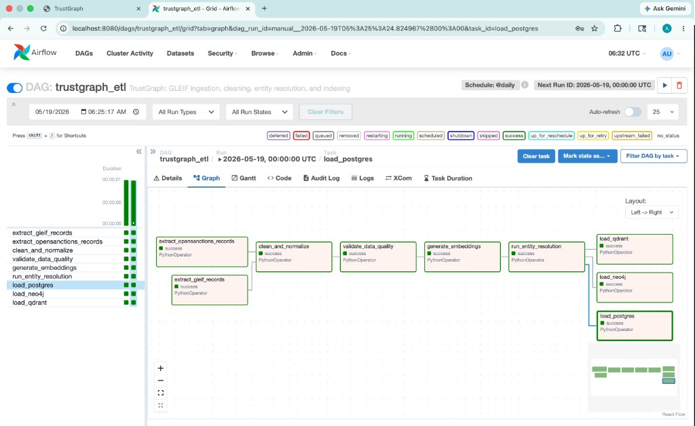
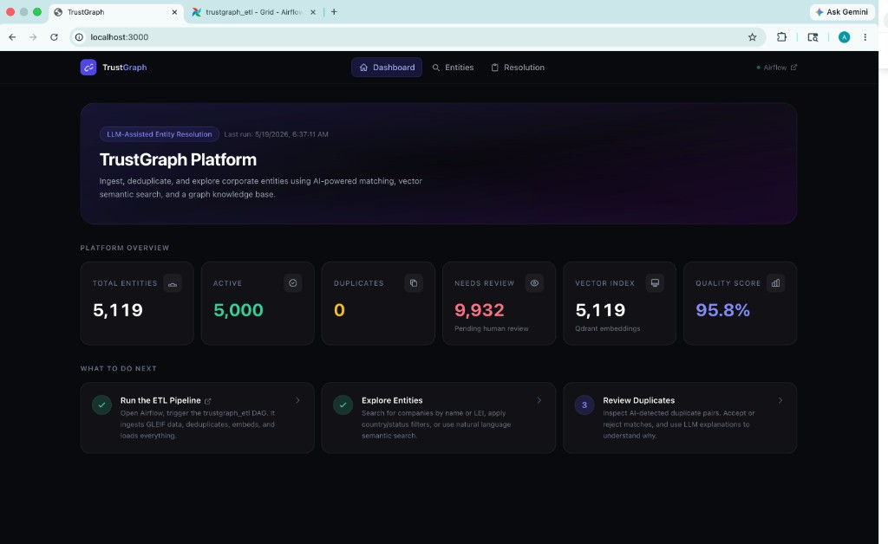
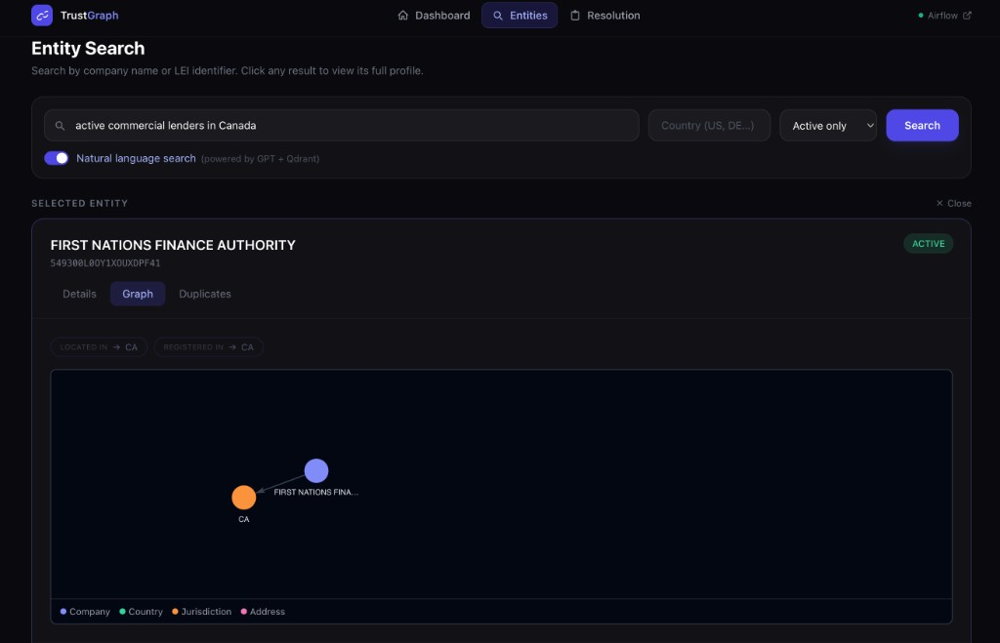
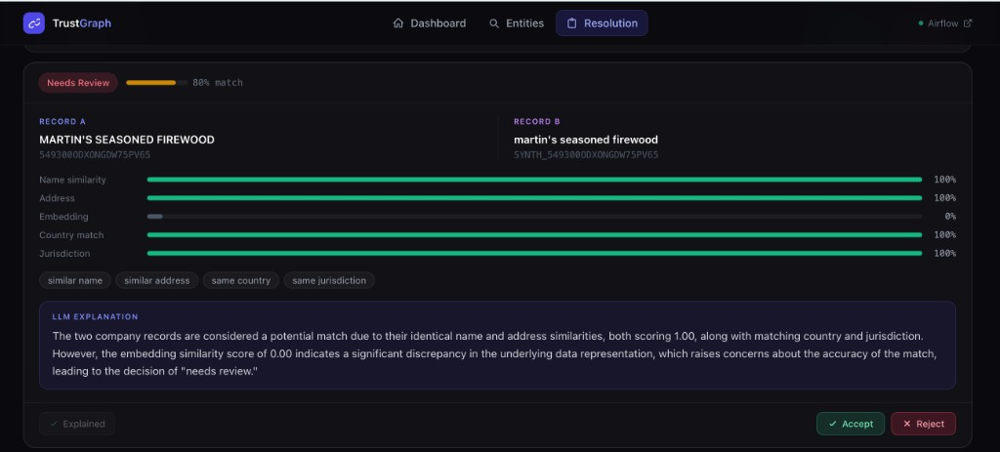

# TrustGraph

> End-to-end identity data platform for legal entity verification — built with Airflow, Postgres, Neo4j, Qdrant, and an LLM-powered analyst layer.


---

## What is this?

Corporate identity data is messy — the same company appears under dozens of name variations, jurisdictions, and registration IDs across different datasets. TrustGraph solves that.

It ingests **50,000+ legal entity records** from GLEIF (the global LEI registry), runs them through a full data engineering pipeline — cleaning, validation, deduplication, embedding, and graph loading — and surfaces the result as a queryable platform with semantic search and an LLM analyst assistant.

The goal: demonstrate a production-grade data engineering workflow end-to-end, from raw source files to multi-database storage, with an AI layer on top.

---

## What it does

| | Capability |
|---|---|
| 🔄 | **ETL pipeline** — Airflow DAG extracts GLEIF + OpenSanctions data, cleans and normalizes it, runs data quality checks, generates embeddings, resolves duplicates, and loads three databases |
| 🧹 | **Data cleaning** — normalizes company names, addresses, country codes, and entity status fields |
| ✅ | **Data quality** — automated checks with pass/fail metrics persisted in PostgreSQL |
| 🔍 | **Entity resolution** — hybrid scoring with RapidFuzz (name/address fuzzy match) + sentence-transformers (semantic embeddings) |
| 🕸️ | **Graph modeling** — Neo4j stores parent/subsidiary ownership chains and resolution matches as a traversable graph |
| 🧠 | **Semantic search** — natural-language queries parsed by LLM into structured filters, then executed against a Qdrant vector index |
| 🤖 | **LLM assistant** — GPT-4o-mini generates match explanations, verification reports, and query parsing via structured function calling |

---

## Tech stack

| Layer | Tools |
|---|---|
| **Orchestration** | Apache Airflow 2.9 (LocalExecutor, Postgres backend) |
| **Storage** | PostgreSQL 16 · Neo4j 5 (APOC) · Qdrant |
| **ML / NLP** | sentence-transformers `all-MiniLM-L6-v2` · RapidFuzz |
| **LLM** | OpenAI `gpt-4o-mini` — structured JSON output via function calling |
| **Backend** | Python 3.11 · FastAPI · SQLAlchemy · Pydantic |
| **Frontend** | Next.js 14 (App Router) · Tailwind CSS · react-force-graph-2d |
| **Infra** | Docker Compose — 6 services, health checks, volume mounts |

---

## Process flow

```
GLEIF LEI Golden Copy (50k)
OpenSanctions Entities (20k)
Synthetic Duplicates (generated)
             │
     ┌───────▼────────┐
     │  Airflow DAG   │  trustgraph_etl  @daily
     └───────┬────────┘
             │
   ┌─────────┼──────────┐
   ▼         ▼          ▼
Extract   Extract    Generate
GLEIF   OpenSanc.  Synthetics
   └─────────┬──────────┘
             ▼
     Clean & Normalize
    (names · addresses · countries · status)
             │
             ▼
     Validate Data Quality
    (checks → JSON report → Postgres)
             │
             ▼
     Generate Embeddings
    (MiniLM-L6 text profiles → vectors)
             │
             ▼
     Entity Resolution
    (RapidFuzz + cosine similarity → scored pairs)
             │
      ┌──────┼──────┐
      ▼      ▼      ▼
 Postgres  Neo4j  Qdrant
(records) (graph) (vectors)
             │
      FastAPI (16 endpoints)
             │
      LLM Layer (gpt-4o-mini)
             │
      Next.js Dashboard
```

The Airflow DAG running all 9 tasks end-to-end:



---

## Entity resolution scoring

Duplicate detection uses a weighted similarity score across 5 signals:

```
final_score =  0.35 × name_similarity        (RapidFuzz token sort)
             + 0.25 × address_similarity      (RapidFuzz partial)
             + 0.20 × embedding_similarity    (cosine, MiniLM-L6)
             + 0.10 × country_match
             + 0.10 × jurisdiction_match
```

| Score | Label |
|---|---|
| ≥ 0.85 | `same_entity` — auto-merged |
| 0.65 – 0.85 | `needs_review` — queued for human |
| < 0.65 | `different_entity` |

---

## Dashboard

The Next.js frontend gives a live view of pipeline metrics, entity search, graph visualization, and the entity resolution review queue.



**Natural-language entity search** — query like *"active commercial lenders in Canada"* is parsed by the LLM into structured filters, hits Qdrant, and returns results with an inline knowledge graph view.



**Resolution review queue** — side-by-side duplicate comparison with per-signal similarity bars and an LLM-generated plain-English explanation. Analyst accepts or rejects with one click.



---

## How to run

**Prerequisites:** Docker Desktop · OpenAI API key

```bash
git clone https://github.com/your-username/trustgraph.git
cd trustgraph
cp .env.example .env
```

Edit `.env` — two values to fill in:

```bash
OPENAI_API_KEY=sk-proj-...

# generate a Fernet key for Airflow
python3 -c "from cryptography.fernet import Fernet; print(Fernet.generate_key().decode())"
AIRFLOW__CORE__FERNET_KEY=<paste output>
```

```bash
docker compose up --build
```

| Service | URL | Credentials |
|---|---|---|
| Dashboard | http://localhost:3000 | — |
| API (Swagger) | http://localhost:8000/docs | — |
| Airflow | http://localhost:8080 | `admin` / `admin` |
| Neo4j Browser | http://localhost:7474 | — |
| Qdrant | http://localhost:6333/dashboard | — |

Then in Airflow: enable and trigger the `trustgraph_etl` DAG. First run takes ~15–30 min (download + embedding).

---

## Data sources

| Dataset | Description |
|---|---|
| [GLEIF LEI Golden Copy](https://www.gleif.org/en/lei-data/gleif-golden-copy/download-the-golden-copy) | 50k legal entity records — LEI, name, address, jurisdiction, status |
| [GLEIF Level 2](https://www.gleif.org/en/lei-data/access-and-use-lei-data/level-2-data-who-owns-whom) | Parent/subsidiary ownership relationships |
| [OpenSanctions](https://www.opensanctions.org/datasets/) | Sanctions and watchlist entities for risk matching |
| Synthetic duplicates | Programmatically generated noisy copies for entity resolution benchmarking |

---

## Built with

| Tool | Role |
|---|---|
| [Cursor](https://cursor.com) | AI-native IDE used for the entire development workflow |
| [Anthropic Claude Sonnet 4.6](https://www.anthropic.com) | Code generation, architecture decisions, debugging |
| [OpenAI GPT-4o-mini](https://platform.openai.com) | In-app LLM — match explanations, verification reports, query parsing |
| [sentence-transformers `all-MiniLM-L6-v2`](https://huggingface.co/sentence-transformers/all-MiniLM-L6-v2) | Entity profile embeddings for semantic search |

---

## License

Copyright © 2026 Abhay Lal. All rights reserved.

This project and its source code are proprietary. No part of this repository may be copied, modified, distributed, or used for commercial purposes without explicit written permission from the author. See [LICENSE](LICENSE) for full terms.
