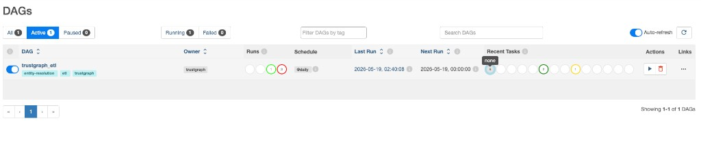

# TrustGraph

**End-to-end identity data platform for legal entity verification.**

Ingests 50,000+ GLEIF legal entity records, resolves duplicates with hybrid fuzzy + vector matching, models corporate ownership in a graph, and surfaces an LLM-powered analyst assistant.

---

## Tech Stack

| Layer | Tools |
|---|---|
| **Orchestration** | Apache Airflow 2.9 |
| **Storage** | PostgreSQL 16 · Neo4j 5 · Qdrant |
| **ML / Search** | sentence-transformers (MiniLM-L6) · RapidFuzz · OpenAI gpt-4o-mini |
| **Backend** | Python 3.11 · FastAPI · SQLAlchemy |
| **Frontend** | Next.js 14 · Tailwind CSS |
| **Infra** | Docker Compose |


---

## Pipeline

The core is a 9-task Airflow DAG that runs the full ETL from raw source data to all three databases.

```
GLEIF (50k records) · OpenSanctions · Synthetic Duplicates
                          │
                    Airflow ETL DAG
                          │
           ┌──────────────┼──────────────┐
        Extract        Clean          Validate
                          │
           ┌──────────────┼──────────────┐
        Embed        Entity          Load
     (MiniLM-L6)   Resolution       DBs
                          │
         ┌────────────────┼────────────────┐
    PostgreSQL          Neo4j           Qdrant
   (structured)        (graph)         (vectors)
                          │
                    FastAPI · LLM Layer
                          │
                   Next.js Dashboard
```



---

## What It Does

| Capability | Detail |
|---|---|
| **Data ingestion** | Airflow DAG downloads GLEIF LEI golden copy, OpenSanctions entities, generates synthetic duplicates |
| **Data cleaning** | Normalizes company names, addresses, country codes, and status fields |
| **Data quality** | Automated checks with pass/fail metrics persisted in PostgreSQL |
| **Entity resolution** | Hybrid scoring — RapidFuzz (name + address) + sentence-transformers (semantic embeddings) |
| **Graph modeling** | Neo4j stores parent/subsidiary relationships and resolution matches |
| **Semantic search** | NL queries parsed by LLM → structured filters → Qdrant vector search |
| **LLM assistant** | gpt-4o-mini generates match explanations, verification reports, and query parsing |
| **REST API** | FastAPI — entity lookup, resolution, semantic search, LLM, pipeline stats |

---

## Entity Resolution

Duplicate detection using a weighted similarity score across 5 signals:

```
final_score =  0.35 × name_similarity
             + 0.25 × address_similarity
             + 0.20 × embedding_similarity
             + 0.10 × country_match
             + 0.10 × jurisdiction_match
```

| Score | Decision |
|---|---|
| ≥ 0.85 | `same_entity` |
| 0.65 – 0.85 | `needs_review` |
| < 0.65 | `different_entity` |

---

## Getting Started

**Prerequisites:** [Docker Desktop](https://www.docker.com/products/docker-desktop/) · OpenAI API key

```bash
git clone https://github.com/your-username/trustgraph.git
cd trustgraph
cp .env.example .env
# fill in OPENAI_API_KEY and AIRFLOW__CORE__FERNET_KEY
docker compose up --build
```

| Service | URL |
|---|---|
| UI | http://localhost:3000 |
| API docs | http://localhost:8000/docs |
| Airflow | http://localhost:8080 — `admin` / `admin` |
| Neo4j Browser | http://localhost:7474 |
| Qdrant Dashboard | http://localhost:6333/dashboard |

Once running, enable and trigger the `trustgraph_etl` DAG in Airflow. First run takes ~15–30 min (download + embedding).

---

## Data Sources

- [GLEIF LEI Golden Copy](https://www.gleif.org/en/lei-data/gleif-golden-copy/download-the-golden-copy) — 50k legal entity records
- [GLEIF Level 2 Data](https://www.gleif.org/en/lei-data/access-and-use-lei-data/level-2-data-who-owns-whom) — parent/subsidiary ownership relationships
- [OpenSanctions](https://www.opensanctions.org/datasets/) — sanctions and watchlist entities
- Synthetic duplicates — programmatically generated noisy copies for entity resolution testing
